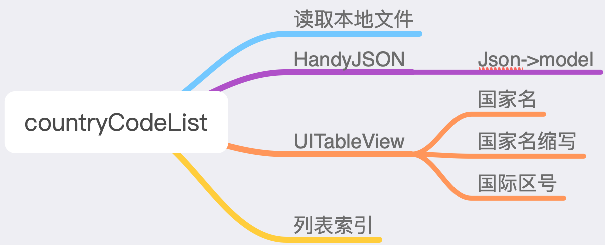
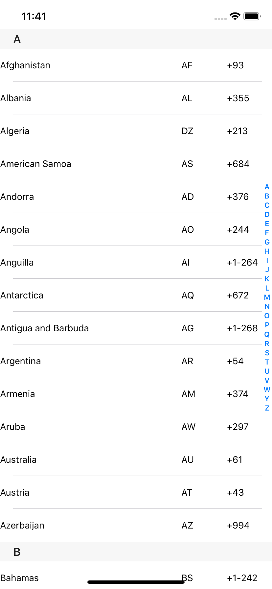

# CountryCodeList
**CountryCodeList**是swift5学习的一个项目。主要练习了`UITableView`的swift使用,使用**HandyJson**把从本地读取的json文件转化为数据模型数组。全球国家列表的数据来源是之前从一张全球国家列表的**sql**表中使用**Python**洗出来的数据，经过处理之后形成了一个**Json**文件。

每一个国家对象主要包括了：**国家的英文名**、**国家的缩写**、**国际区号**。

练习项目结构图:

效果展示如下：

>全球国家列表已经进过精心整理成**JSON**文件，数据对于要做面向海外开发的同学还是有一定帮助的，可以直接使用。
